# Project-Management-Final-Project

**Class:** L5AC

**Members:**
- Ella Raputri (2702298154)
- Ellis Raputri (2702298116)
- Vammy Johannis Jiang (2702368122)

**Deployment Link:** [Click here](https://project-management-final-project-production.up.railway.app/)

 

## Project Description
CQGamePro is a Desktop Web-Based Chinese Learning Interactive Quiz Game that incorporates educational aspects along with recreation and gamification elements. This website provides three kinds of games, i.e. unjumble questions, fruit slicing game, and complete sentence. The website also provides a simple quiz management system for the teachers to create, edit, and share the quizzes.

 

## Pages Screenshots

&ensp;<b>Welcome Page</b>

  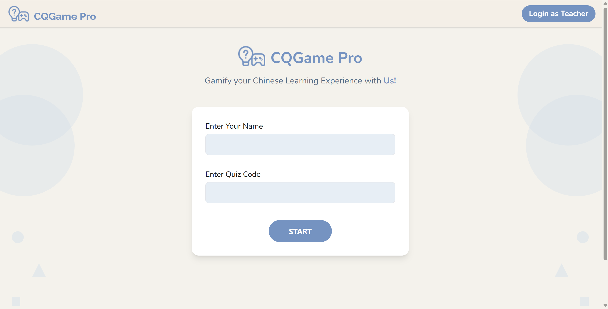 
 

 

&ensp;<b>Login Page</b>

  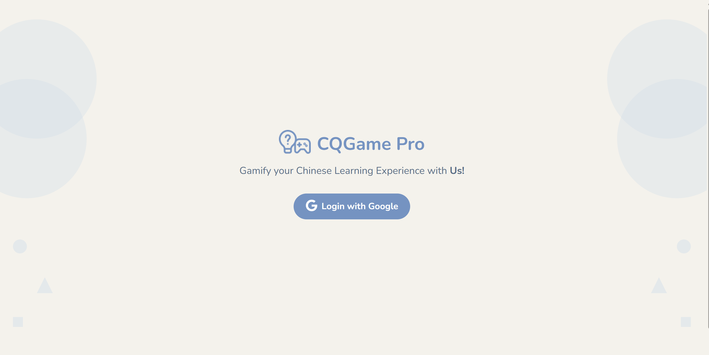 
 

 

&ensp;<b>Student (unjumble game page)</b>

  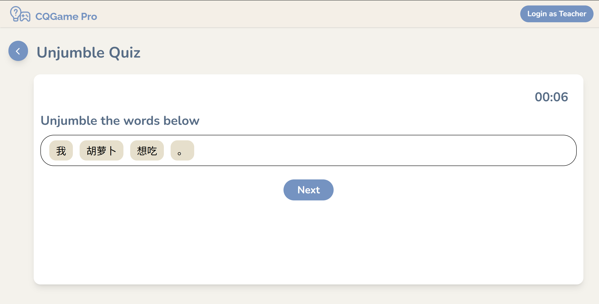 
  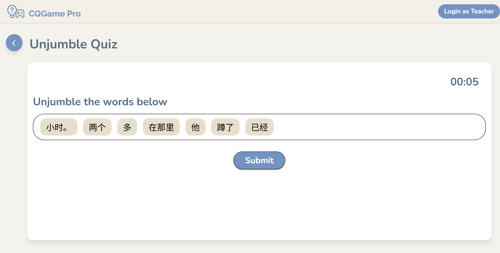 
  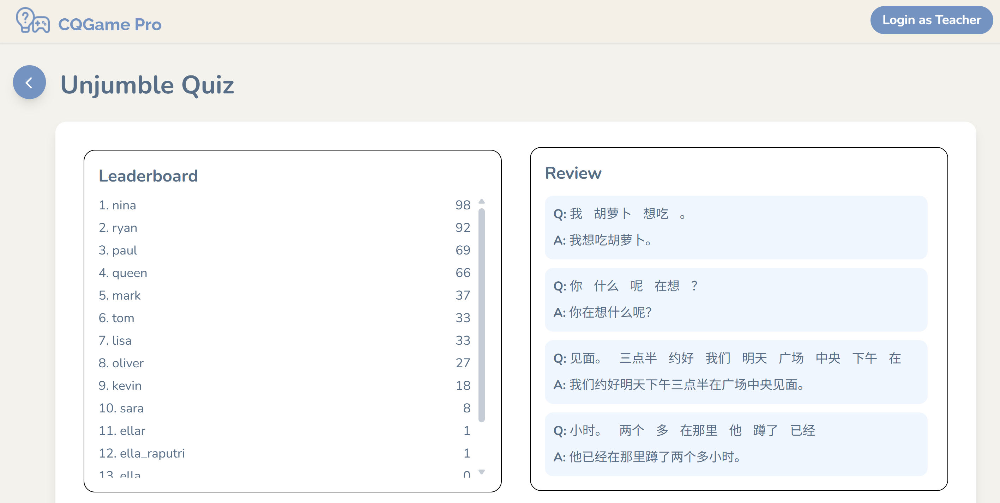 
 

 

&ensp;<b>Student (fruit slicing game page)</b>

  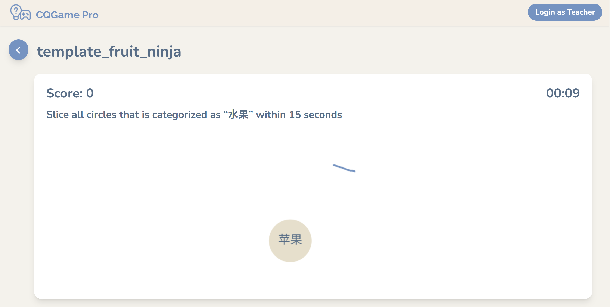 
  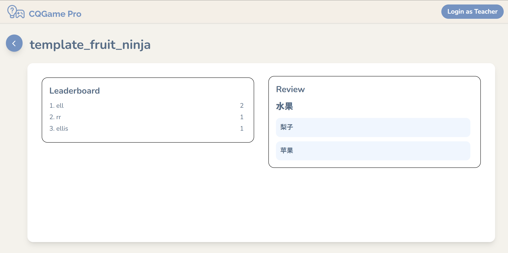 

 

 

&ensp;<b>Student (complete sentence game page)</b>

  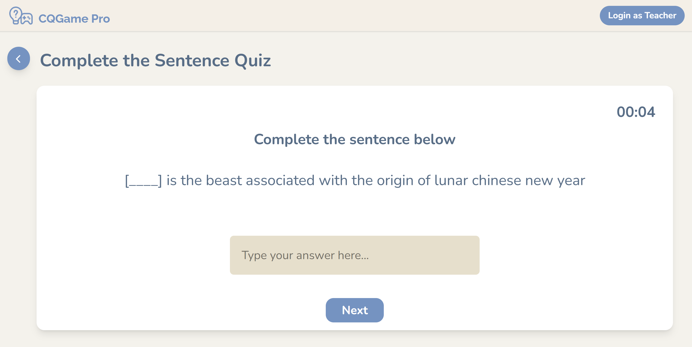 
  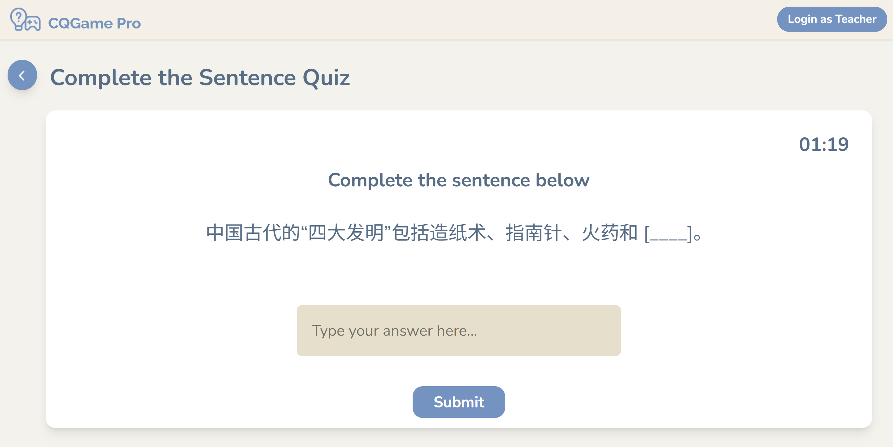 
  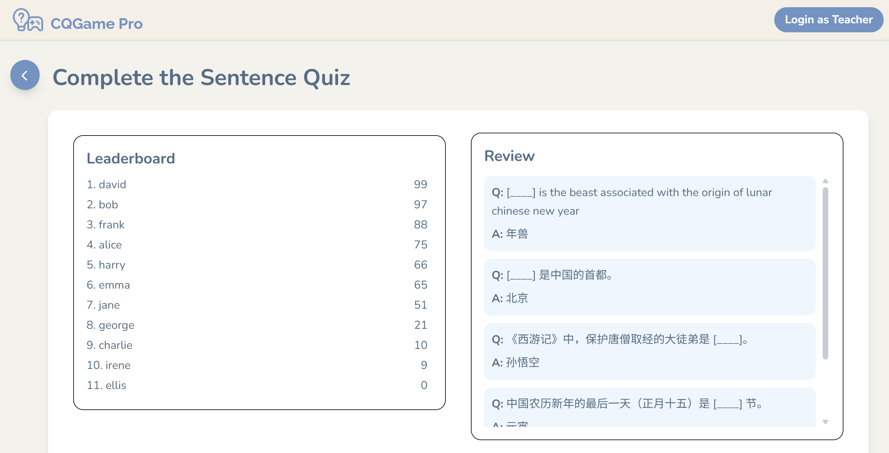 

 

 

&ensp;<b>Teacher (quiz list page)</b>

  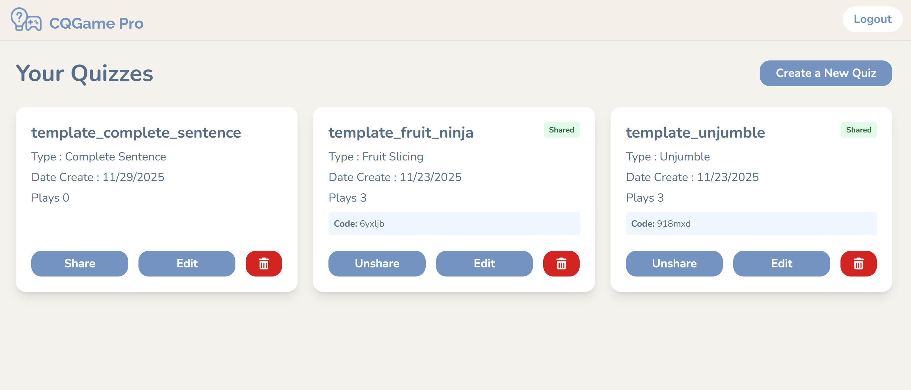 

 

 

&ensp;<b>Teacher (create quiz page)</b>

  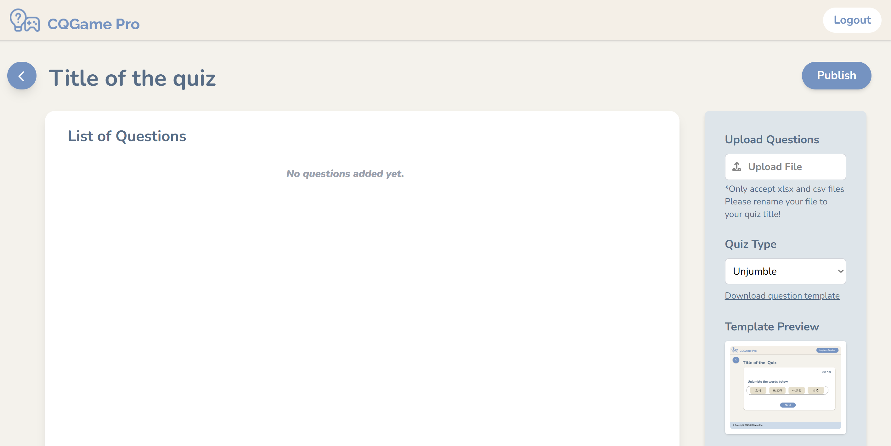 
  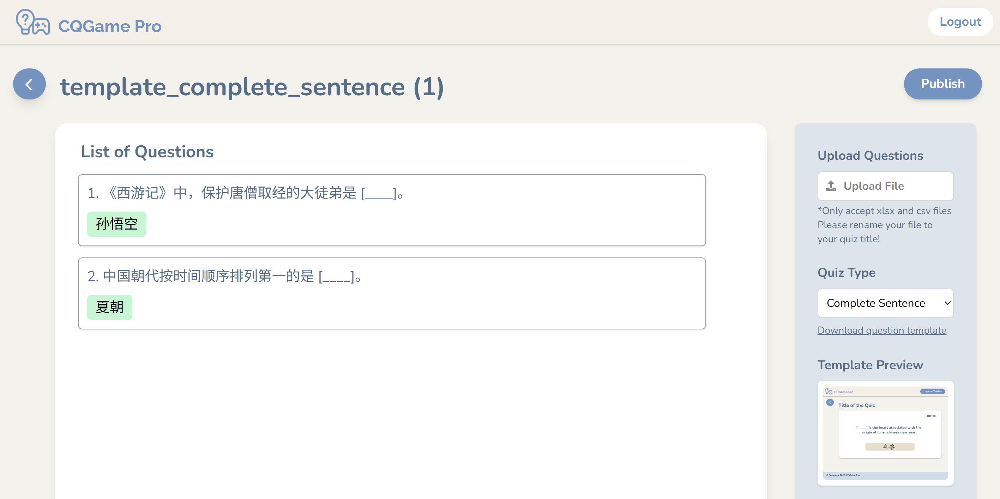 
 

 

## Contact Information

If you have any questions or feedback, please kindly contact us:
- Instagram: [Click here](https://instagram.com/raputriella?igshid=OGQ5ZDc2ODk2ZA==)
- Whatsapp: [Click here](https://wa.me/62895629504490)
- Phone number: +62895629504490